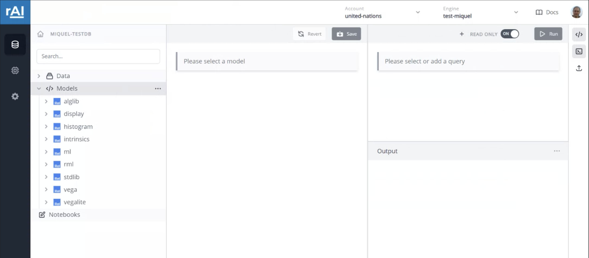
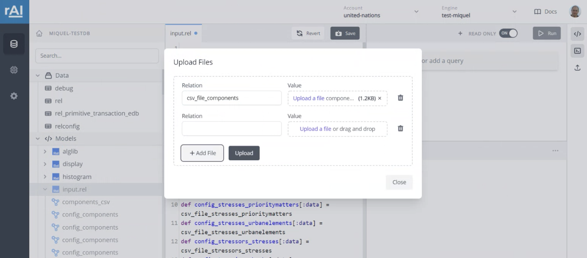
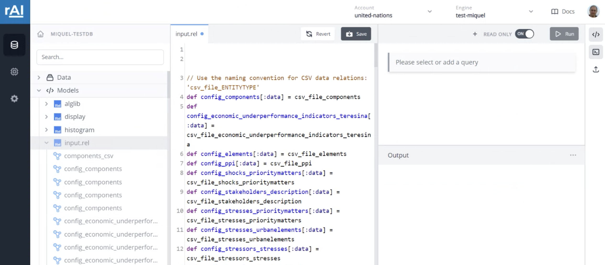
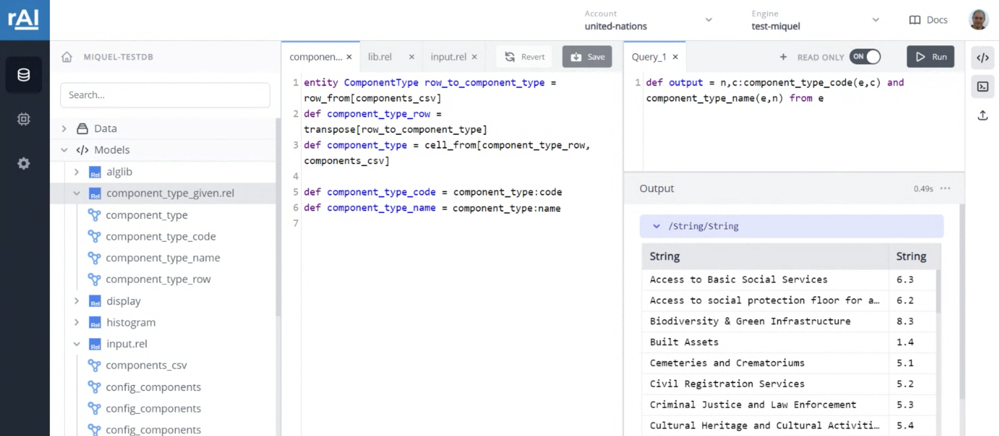

# City Resilience Profiling Tool - Ontology and Rel implementation

This repository holds the resources for the UN-CPRT project. The folder structure is as follows:

 * _data_: sample data shared by the UN team
 * _src/rel_: Rel source files
 * _src/julia_: julia scripts for installing relations to the KGMS and running the prototype application 
 * _notebook_: exported notebook files from RAI Console (currently empty)
 * _un-crpt_: the folder containing the Visual Studio solution file (needed for NORMA)
 * _images_: it contains screenshots used in this README

### Getting started with RAI Cloud

1. Create a notebook on RAI Cloud. Once it is ready, you are presented with the following screen, where under _Models_ the default Rel resources and libraries are already present:

2. To make data available in RAI Console, right click on _Data_, then select _Upload_. Here use the naming convention as shown in the image below, i.e., prefix the relation name with `csv_file_` and name it based on the file contents. E.g., in the example below we are uploading the _components.csv_ file that is containing component types and codes in each lines that will be mapped to component type entities in the knowledge graph, thus the relation name is `csv_file_components`. 

3. Right click on _Models_, then select _Import_. This should allow you to one by one upload the necessary Rel sources found in this git repository under _src/rel_. Note that if uploaded models are not saved, they are greyed out in the console. In this case click the save button, and if that does not change anything, refresh the page. (Note: it is a good idea to save often while the notebook interface is still in development phase.) It may be the case that there are some errors popping up when uploading the model files. This is normal, as there are files that depend on other ones. Once all model files are uploaded and all data files have been added, all error messages should disappear.
In the figure below, _input.rel_ is uploaded, but not saved, as indicated by the blue dot next to its name on the tab at the top of the screen.

4. Once all Rel files have been added to console, you should be able to issue queries and see the results presented below the query window.

